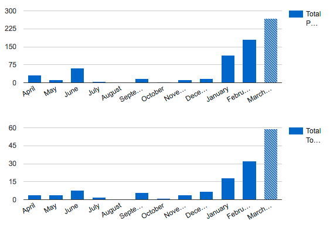

# Unix Philosophy & Django projects

Applying the Unix Philosophy to Django projects:

**a report from the real world**

## Who am I?

**Federico Capoano** (A.K.A. [Nemesis](http://nemesisdesign.net))

[OpenWISP](http://openwisp.org/) core developer

Working on [public wifi](http://openwifi.cineca.it/) at [Cineca](https://www.cineca.it/en) since 2012

## OpenWISP


## What is OpenWISP?

[OpenWISP](http://openwisp.org/) is a set of software modules that can be used to deploy and manage wireless networks

(public wifi, backbone, mesh networks)

## OpenWISP 1

OpenWISP 1: started in 2008-2016

Focused on [public wifi](http://openwifi.cineca.it/) for Italian cities

Fast growth of features to accommodate requirements

## Problems of OpenWISP 1

- monolithic ruby on rails apps
- tight coupling
- duplicated logic
- policy not separated from mechanisms
- complexity

## Negative consequences (OpenWISP 1)

These problems caused several very negative consequences

## 1. "Giant ball of mud" problems

Hard to add new features in a clean way

Hard to maintain over time (eg: upgrade dependencies, fix bugs)

## 2. Inflexibility

Hard to extend without changing the core

Hard to reuse in different contexts with different requirements

## 3. Little or no contributions

Complexity scared away potential external contributors

We only got low quality patches which were never merged

## 4. Costs and risk of death

Increased costs to keep the project alive

Many years of work risked to fade into oblivion

## Nikola is not happy


# This can't be...

There must be a better way!

## Back to the masters


# The Unix Philosophy

What is the unix philosophy?

## 1. Approach to software development

- Bottom-up
- Pragmatic
- Grounded in experience
- Founded in empirical skepticism

## 2. Mature

Evolved in the **Unix** community since 1970

## 3. Change tolerant

Born during the digital revolution 1970-2010

It kept pace with the dramatic evolution of technology

# The Unix Philosophy in short

What are the main concepts of the Unix philosophy?

## "Do one thing and do it well"

Break down big problems in smaller problems

Write simple programs that solve one problem well

Write programs to work together

Value simplicity and maintainability over performance and complexity

# What advantages does it bring?

What are the main advantages of applying the Unix philosophy?

## 1. Saner development

Solving one problem at time is simpler

## 2. Maintainability

Maintain a simple program is less hard

## 3. Usability

A simple program is easier to use

## 4. Readability

A simple program is easier to read and understand

## 5. Agility

A simple program will be easier to readapt to new requirements

## 6. Reuse

Being easier to use, understand, read and maintain, it will be readapted to work in different contexts and will attract more contributors

# Me gusta


# The Unix Philosophy in detail

The 17 rules of the Unix Philosophy

From "The art of unix programming"

by Eric Raymond

## 1. Rule of Modularity

Write simple parts connected by clean interfaces

[source](http://www.catb.org/esr/writings/taoup/html/ch01s06.html#id2877537)

## 2. Rule of Clarity

Clarity is better than cleverness

[source](http://www.catb.org/esr/writings/taoup/html/ch01s06.html#id2877610)

## 3. Rule of Composition

Design programs to be connected to other programs

[source](http://www.catb.org/esr/writings/taoup/html/ch01s06.html#id2877684)

## 4. Rule of Separation

Separate policy from mechanism;

separate interfaces from engines

[source](http://www.catb.org/esr/writings/taoup/html/ch01s06.html#id2877777)

## 5. Rule of Simplicity

Design for simplicity;

add complexity only where you must

[source](http://www.catb.org/esr/writings/taoup/html/ch01s06.html#id2877917)

## 6. Rule of Parsimony

Write a big program only when it is clear by demonstration that nothing else will do

[source](http://www.catb.org/esr/writings/taoup/html/ch01s06.html#id2878022)

## 7. Rule of Transparency

Design for visibility to make inspection and debugging easier

[source](http://www.catb.org/esr/writings/taoup/html/ch01s06.html#id2878054)

## 8. Rule of Robustness

Software is said to be robust when it performs well under unexpected conditions which stress the designer's assumptions, as well as under normal conditions

[source](http://www.catb.org/esr/writings/taoup/html/ch01s06.html#id2878145)

## 9. Rule of Representation

Fold knowledge into data so program logic can be stupid and robust

[source](http://www.catb.org/esr/writings/taoup/html/ch01s06.html#id2878263)

## 10. Rule of Least Surprise

In interface design, always do the least surprising thing

[source](http://www.catb.org/esr/writings/taoup/html/ch01s06.html#id2878339)

## 11. Rule of Silence

When a program has nothing surprising to say, it should say nothing

[source](http://www.catb.org/esr/writings/taoup/html/ch01s06.html#id2878450)

## 12. Rule of Repair

When you must fail, fail noisily and as soon as possible

[source](http://www.catb.org/esr/writings/taoup/html/ch01s06.html#id2878538)

## 13. Rule of Economy

Programmer time is expensive; conserve it in preference to machine time

[source](http://www.catb.org/esr/writings/taoup/html/ch01s06.html#id2878666)

## 14. Rule of Generation

Avoid hand-hacking; write programs to write programs when you can

[source](http://www.catb.org/esr/writings/taoup/html/ch01s06.html#id2878742)

## 15. Rule of Optimization

Prototype before polishing;

get it working before you optimize it

[source](http://www.catb.org/esr/writings/taoup/html/ch01s06.html#rule_of_optimization)

## 16. Rule of Diversity

Distrust all claims for “one true way”

[source](http://www.catb.org/esr/writings/taoup/html/ch01s06.html#id2879078)

## 17. Rule of Extensibility

Design for the future, because it will be here sooner than you think

[source](http://www.catb.org/esr/writings/taoup/html/ch01s06.html#id2879112)

# Approved


# How to apply it to Django?

How to apply the Unix philosophy to [django](https://www.djangoproject.com/) projects?

Let's see some real world examples from [OpenWISP](http://openwisp.org/)

## 1. Rule of Modularity

Develop main features as [reusable django apps](https://docs.djangoproject.com/en/dev/intro/reusable-apps/)

One django app for each group of related features

Document your app properly

Include a [license](https://choosealicense.com/) and a [changelog](http://keepachangelog.com/)

Publish your app on [pypi](https://pypi.org/) and [djangopackages.org](https://djangopackages.org/)

## 1. Real world examples

- Configurations of routers and VPNs: [django-netjsonconfig](https://github.com/openwisp/django-netjsonconfig)
- PKI management (x509 certificates): [django-x509](https://github.com/openwisp/django-x509)
- Multi-tenancy: [contributed to django-organizations](https://github.com/bennylope/django-organizations/pull/119)

**reuse existing projects when possible!**

## 2. Rule of Clarity

*Explicit is better than implicit*

This is already a widely accepted concept in the python world

## 3. Rule of Composition

Combine, extend and customize django reusable apps in your final django project

## 3. Real world examples

[openwisp-users](https://github.com/openwisp/openwisp-users): extends django-organizations
[openwisp-controller](https://github.com/openwisp/openwisp-controller): depends on [openwisp-users](https://github.com/openwisp/openwisp-users) and extends [django-netjsonconfig](https://github.com/openwisp/django-netjsonconfig) and [django-x509](https://github.com/openwisp/django-x509)

Final result handled by [ansible-openwisp2](https://github.com/openwisp/ansible-openwisp2) in an (almost) transparent manner

## 4. Rule of Separation

- implement complex algorithms as libraries
- make these libraries highly configurable
- make these libraries a dependency of your project
- implement policy as a configuration

## 4. Real world examples

[netjsonconfig](https://github.com/openwisp/netjsonconfig): python library for generating router & VPN configurations from [NetJSON](http://netjson.org/) objects

[django-netjsonconfig](https://github.com/openwisp/django-netjsonconfig): web interface to netjsonconfig

## 4. Real world examples

Screenshot of advanced mode

## 5. Rule of Simplicity

- start with very basic features
- release your project early, even if you feel it's incomplete
- add one feature at time as your understanding grows

## 5. Real world examples

as of March 2017:

- 24 releases of [netjsonconfig](https://github.com/openwisp/netjsonconfig)
- 25 releases of [django-netjsonconfig](https://github.com/openwisp/django-netjsonconfig)
- 5 releases of [django-x509](https://github.com/openwisp/django-x509)

## 6. Rule of Parsimony

Prefer creating new reusable apps when adding big features

unless doing this complicates things a lot with no real advantages

## 6. Real world examples

PKI management in new app: [django-x509](https://github.com/openwisp/django-x509)

VPN configurations added to existing app: [django-netjsonconfig](https://github.com/openwisp/django-netjsonconfig)

## 7. Rule of Transparency

Log weird events using the python logging facility

## 7. Real world examples

[Logging of bad requests in django-netjsonconfig](https://github.com/openwisp/django-netjsonconfig/blob/622f3bfcc617ebe4525cf0b74cd21b440a48644d/django_netjsonconfig/utils.py#L84)

```python
import logging
logger = logging.getLogger(__name__)

def invalid_response(request, error, status):
    logger.warning(error, extra={'request': request, 'stack': True})
    return ControllerResponse(error, status=status)
```

## 7. Real world examples

Provide good default logging

Provide support for [sentry](https://sentry.io)

[Take a look at a real example](https://github.com/openwisp/ansible-openwisp2/blob/90a619d391b1148239830f7a1a20402b83ef9905/templates/openwisp2/settings.py#L159-L220)

## 8. Rule of Robustness

Add constraints to your reusable django apps only when necessary:

- avoid strict validation rules
- provide configurable settings

## 8. Real world examples

- [settings in django-netjsonconfig](https://github.com/openwisp/django-netjsonconfig#settings)
- [settings in django-x509](https://github.com/openwisp/django-x509#settings)

## 9. Rule of Representation

Fold complex information in data structures stored in text fields

## 9. Real world examples

in [OpenWISP 2](https://github.com/openwisp/ansible-openwisp2), configuration of routers is implemented as a single text field formatted as [NetJSON](http://netjson.org/)

(in OpenWISP 1 each available configuration had its own database table and model, very hard to maintain and evolve)

## 9. Real world example

```python
>>> from netjsonconfig import OpenWrt
>>> router = OpenWrt({
...     "general": {"hostname": "HomeRouter"}
... })
>>> print(router.render())
package system

config system 'system'
        option hostname 'HomeRouter'
        option timezone 'UTC'
        option zonename 'UTC'
```

## 9. NetJSON configuration


[Full size image](https://raw.githubusercontent.com/nemesisdesign/applying-the-unix-philosophy-to-django-projects/master/images/netjson-advanced-mode-full.png)

## 9. Result config (OpenWRT)


[Full size image](https://raw.githubusercontent.com/nemesisdesign/applying-the-unix-philosophy-to-django-projects/master/images/preview-config-full.png)

## 10. Rule of Least Surprise

This has become a widely accepted concept in the IT industry

## 11. Rule of Silence

**Just don't make your apps annoying**

It's not that hard :-P

## 12. Rule of Repair

*Errors should never pass silently*

*Unless explicitly silenced*

(from the [zen of python](https://www.python.org/dev/peps/pep-0020/))

Let's add: **fail fast, noisily and early**

## 12. Real world examples

```python
from django.core.exceptions import ImproperlyConfigured
from .settings import REGISTRATION_ENABLED, SHARED_SECRET

if REGISTRATION_ENABLED and not SHARED_SECRET:
    raise ImproperlyConfigured('NETJSONCONFIG_SHARED_SECRET not set!')
```

Full real world example available in [django-netjsonconfig](https://github.com/openwisp/django-netjsonconfig/blob/622f3bfcc617ebe4525cf0b74cd21b440a48644d/django_netjsonconfig/apps.py#L38-L42)

## 13. Rule of Economy

When Unix was born this was a radical idea:

assembler was the norm, **C** was considered a higher level language

**Python** is a consequence of the success of that radical idea

**Embrace this concept**

## 14. Rule of Generation

When you find yourself writing lots of boilerplate code, try to use **meta-programming**

If you need glue code, write generators

## 14. meta-programmed urlpatterns

[urls.py in openwisp-controller](https://github.com/openwisp/openwisp-controller/blob/db77ae759161160502e20cac21f34f3f6b87e7f3/openwisp_controller/urls.py)

## 14. Auto-generated UI from json-schema


[Full size image](https://raw.githubusercontent.com/nemesisdesign/applying-the-unix-philosophy-to-django-projects/master/images/autogenerated-ui.png)

## 15. Rule of Optimization

- write a first early version of your django app
- do not forget to write automated tests
- refactor and polish

## 16. Rule of Diversity

Maintain a skeptic attitude towards dogmas and fads

Measure before optimizing

Prototype before investing time in radical ideas

## 17. Rule of Extensibility

Provide ways to extend and customize the behaviour of modules without the need of changing the core code

## 17. Extensibility: abstract models

Provide abstract models in your most important modules

Store these in a python file which does not import concrete models

(otherwise other django-apps won't be able to import them)

## 17. Extensibility: abstract models

[abstract models in django-netjsonconfig](https://github.com/openwisp/django-netjsonconfig/blob/622f3bfcc617ebe4525cf0b74cd21b440a48644d/django_netjsonconfig/base/base.py)

[example usage](https://github.com/openwisp/django-netjsonconfig/tree/622f3bfcc617ebe4525cf0b74cd21b440a48644d#extending-models)

## 17. Extensibility: abstract models

[abstract models in django-x509](https://github.com/openwisp/django-x509/blob/b5fec64f948f639865a77bb5e9a3b17c62d8ef4b/django_x509/base/models.py)

[example usage](https://github.com/openwisp/django-x509/tree/b5fec64f948f639865a77bb5e9a3b17c62d8ef4b#extending-models)

## 17. Extensibility: base admin

Provide base admin classes in your main modules (avoid duplication)

Store them in a python file which does not import concrete models

(otherwise other django-apps won't be able to import them)

## 17. Extensibility: base admin

[base admin classes django-netjsonconfig](https://github.com/openwisp/django-netjsonconfig/blob/622f3bfcc617ebe4525cf0b74cd21b440a48644d/django_netjsonconfig/base/admin.py)

[example usage](https://github.com/openwisp/django-netjsonconfig/tree/622f3bfcc617ebe4525cf0b74cd21b440a48644d#extending-the-admin)

## 17. Extensibility: base views

If your reusable django app has views, provide generic views that can be extended

Store them in a python file which does not import concrete models

(otherwise other django-apps won't be able to import them)

## 17. Extensibility: base views

base views in [django-netjsonconfig](https://github.com/openwisp/django-netjsonconfig/blob/622f3bfcc617ebe4525cf0b74cd21b440a48644d/django_netjsonconfig/controller/generics.py)

[example usage](https://github.com/openwisp/django-netjsonconfig/tree/622f3bfcc617ebe4525cf0b74cd21b440a48644d#extending-controller-views)

## 17. Extensibility: reusable urls

If your app provides views that can be extended, third party apps will have to redefine their URLs

You may want to avoid this required duplication by providing a mechanism to import urls

## 17. Extensibility: reusable urls

reusable urls in [django-netjsonconfig](https://github.com/openwisp/django-netjsonconfig/blob/622f3bfcc617ebe4525cf0b74cd21b440a48644d/django_netjsonconfig/utils.py#L88-L106)

example usage:

```python
from django_netjsonconfig.utils import get_controller_urls
from . import views  # customized views

# creates new url patterns hooked to customized views
urlpatterns = get_controller_urls(views)
```

## 17. Extensibility: AppConfig

If your reusable django app relies on signal connection for some features, provide a default `AppConfig` class

## 17. Extensibility: AppConfig

base `AppConfig` class in  [django-netjsonconfig](https://github.com/openwisp/django-netjsonconfig/blob/622f3bfcc617ebe4525cf0b74cd21b440a48644d/django_netjsonconfig/apps.py)

```python
from django_netjsonconfig.apps import DjangoNetjsonconfigApp

class MyOwnApp(DjangoNetjsonconfigApp):
    name = 'yourapp.config'
    label = 'config'

    def __setmodels__(self):
        from .models import Config, VpnClient  # these are your custom models
        self.config_model = Config
        self.vpnclient_model = VpnClient
```

# Positive results

Positive results achieved in OpenWISP

## 1. Faster release cycle & evolution

We release new features more often

The project is evolving rapidly

## 2. Easier maintainance

Once a bug in a specific module is replicated

fixing it is easier compared to the work needed to fix bugs in OpenWISP 1

## 3. More derivative work

OpenWISP 2 was released officially [less than 1 year ago](https://github.com/openwisp/ansible-openwisp2/commit/0cda721e3428677c28c3116def04dbd5c228b7f6) (as of April 2017)

notwithstanding that, there are already a couple of derivative works

## 4. Growth

The user base has been growing rapidly

## 4. Growth: mailing list



## 4. Growth: GSOC 2017

OpenWISP has been accepted as a mentoring organization

for the [Google Summer of Code 2017](https://summerofcode.withgoogle.com/organizations/5694014226432000/)

# Yay!


# Disadvantages

**Is not a bed of roses**

# Doh


## 1. Integration issues

Combining more django apps may result in integration issues

Changes to integration configuration can result in bugs that are not caught by unit tests

## 1. Solution

**Integration tests** are important in this case

**Shortcut**: I was able to import tests of a base app and repeat them in the extension app

This [easy fix](https://github.com/openwisp/openwisp-controller/commit/cbca4e1246afcf364e3d6d217543390edfb72d8e) was good enough for my case

## 2. Big features

When I needed to introduce a new major feature I needed to change at least a couple of modules

## 2. Solution

**many times this will be necessary**

If you have to change many modules every time, refactor your code to be more loosely coupled

## 3. Repository management overhead

- working with many repositories can be overwhelming
- more git tags, pypi releases, versioning, changelogs
- more announcements for new releases

## 3. Solutions

- import several projects in a single window of your editor
- automate versioning and changelogs (I haven't done this yet)
- do not send announcements for minor releases which contain no real advantage for end users

## 4. Documentation fragmentation

We have many repositories with their own READMEs and docs

We don't have a single documentation website yet.

## 4. Solutions

I added links to specific module docs from the website

I often have to send those links on the mailing list

But a central comprehensive documentation website would be better (we don't have this yet)

## 5. Bug reports

Users don't know where to send bug reports and they write to the mailing list

## 5. Solution

For the moment I reply by pointing to them where to open issues

But a single issue tracker for all the repositories would be better

(even though it may not really solve the "which module?" problem)

## 6. Dispersion of popularity

We no longer have a single popular repository with many github stars

## 6. Solution

**Stop caring about this**

Github stars are not an accurate indicator of the success of a project

# Conclusions

The creators of Unix are not newcomers

Following their heritage is a good idea

# Delve deep

Further resources on the Unix Philosophy and related concepts:

- [the art of unix programming](http://www.catb.org/esr/writings/taoup/html/)
- [the pragmatic programmer](https://pragprog.com/book/tpp/the-pragmatic-programmer)

## Practice

Start to gradually apply these concepts in your projects

EG: extract big features to separate projects

## NO to dogmas

Practice empirical (scientific) skepticism

Test your ideas

Measure your results

## Read existing code

Read the code of OpenWISP

[@openwisp organization on github](https://github.com/openwisp)

(or other projects like [@openstack](https://github.com/openstack))

# Upgrade to sir dev now!


# Thank you

Find me also on:

- [twitter (@nemesisdesign)](https://twitter.com/nemesisdesign)
- [github (@nemesisdesign)](https://github.com/nemesisdesign)
- [linkedin (Federico Capoano)](https://www.linkedin.com/in/federicocapoano/)
